# KoElectra를 활용한 카카오톡 버전별 리뷰 감성 및 이슈 분석

## 프로젝트 개요

국민 메신저 **카카오톡(KakaoTalk)** 의 특정 업데이트(v25.8.0 등) 전후로 발생하는 사용자 반응의 변화를 심층 분석한 프로젝트이다.
한국어 특화 언어 모델인 **KoElectra** 를 Fine-tuning하여 리뷰 텍스트에 담긴 **감성** 과 **구체적인 불만 원인** 을 정량적으로 도출하였다. 
최근 카카오톡의 업데이트에 어떤 의견들을 가지고 있는지를 분석하는 것을 목표로 한다.

### 분석 목표
1.  **감성 분석:** 업데이트 전/후, 논란이 된 버전의 긍정/부정 비율 변화 추적
2.  **이슈 탐지:** 부정 리뷰 내 핵심 키워드를 추출하여 구체적인 불만 원인 파악
3.  **문맥 파악:** 주요 키워드 뒤에 따르는 서술어를 분석하여 사용자 경험(UX)의 디테일한 문제점 도출

---

## 사용 기술 및 데이터

### 1. 데이터셋 (Dataset)
* **출처:** Google Play Store 리뷰 크롤링 
 google_play_scraper 라이브러리를 사용하여 크롤링 하였다.
 2000건 정도를 직접 라벨링하여 샘플 데이터로 삼았다.  
* **대상 버전:**
    * `v25.7.3` (업데이트 전)
    * `v25.8.0` (이슈 발생 버전)
    * `v25.9.0` (최신/수정 버전)
* **데이터 규모:** 약 35000건의 Raw Data
* **전처리:** * 2000건의 샘플 데이터에 대해 **3-Class 라벨링 (긍정/중립/부정)** 수행
    * **클래스 불균형(Class Imbalance)** 해결을 위한 **오버샘플링(Oversampling)** 기법 적용

### 2. 모델링 (Modeling)
* **Base Model:** `monologg/koelectra-small-v3-discriminator`
* **Fine-tuning:**
    * Epochs: 4
    * Optimizer: AdamW (Learning Rate: 5e-5)
    * Loss: CrossEntropyLoss
* **Performance:**
    * **Validation Accuracy: 94.39%**

---

## 분석 결과 

### 1. 버전별 감성 비율 변화
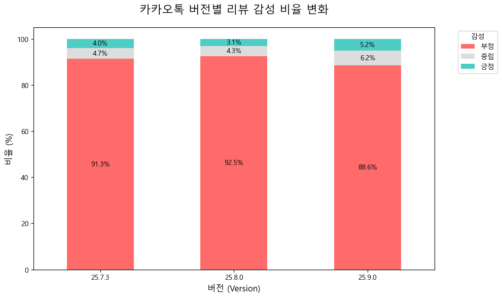

* **v25.7.3:** 부정 리뷰 비율이 높음. 업데이트를 일부러 안하는 사람들도 있기에 이전 버전에도 불만이 많다.
* **v25.8.0:** 부정 리뷰 비율이 높음. 업데이트에 대한 불만이 많다.
* **v25.9.0:** 부정 리뷰 비율이 높음. 여전히 부정 비율이 높지만, 긍정과 중립 비율이 증가하였다.

### 2. 주요 불만 키워드 
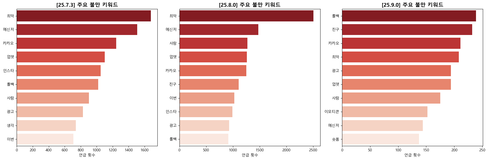

7.3버전과 8.0버전은 직전 버전과 패치 버전이라 그런지 거의 같은 키워드를 공유하고 있다. 9.0버전은 롤백이라는 단어가 가장 주요한 키워드이다.  
위 표를 참고하여 '메신저', '카카오', '업뎃', '친구', '광고' 이 다섯 개를 주요 키워드로 선정한 채, 문맥 분석을 시작하겠다.

### 3. 키워드 문맥 분석  
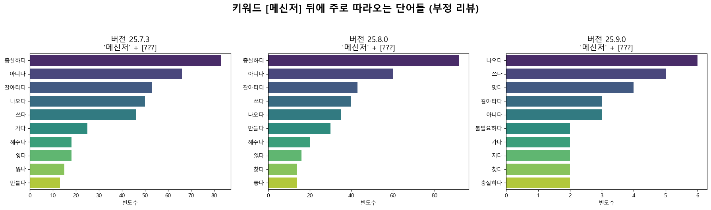
메신저와 가장 많이 붙는 단어가 충실하다. 그 다음이 아니다인 것으로 보아 메신저의 역할에 충실하지 못한 업데이트 라는 비판이 가장 많은 것으로 보인다. 그 다음으로 많이 붙는 단어는 갈아타다 인 것으로 보아 대체제를 찾는 사람이 많을 정도로 큰 파장이 있었던 것으로 보인다. 특이한 점으로는 8.0버전에는 좋다 라는 단어도 들어있다는 점이다. 비꼬는 사람도 많은 것으로 보인다.

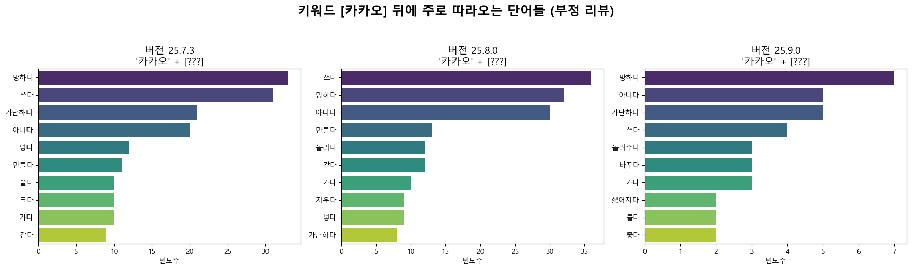
카카오와 가장 많이 붙는 단어가 망하다. 그 다음으로 쓰다, 아니다, 가난하다, 돌리다 같은 단어인 것으로 보아 정말 망한 업데이트이고, 돌려놓았으면 좋겠다는 의견이 많은 것으로 보인다.

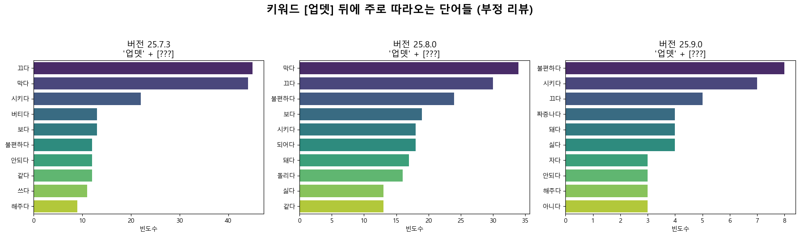
업뎃과 가장 많이 붙는 단어가 끄다, 막다, 불편하다, 짜증나다 와 같은 단어인 것으로 보아 업데이트를 막아놓고 싶을 정도로 업데이트가 정말 불편하고 짜증난다는 의견이 많은 것으로 보인다. 

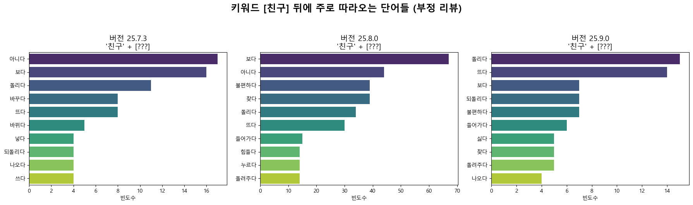
친구 뒤에 가장 많이 붙는 단어가 아니다, 보다, 불편하다, 뜨다, 되돌리다 등인 것으로 보아 친구거나 친구가 아닌 사람의 프로필 사진 등이 계속 뜨는 것이 불편해서 이전으로 되돌려줬으면 하는 의견이 많은 것으로 보인다.

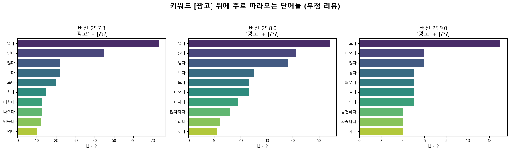
광고 뒤에 가장 많이 붙는 단어가 넣다, 받다, 미치다, 나오다, 늘리다, 많다 등인 것으로 보아 업데이트 이후 광고가 너무 많아서 미칠정도로 싫은 의견이 많은 것으로 보인다.

### 4.주요 긍정 키워드
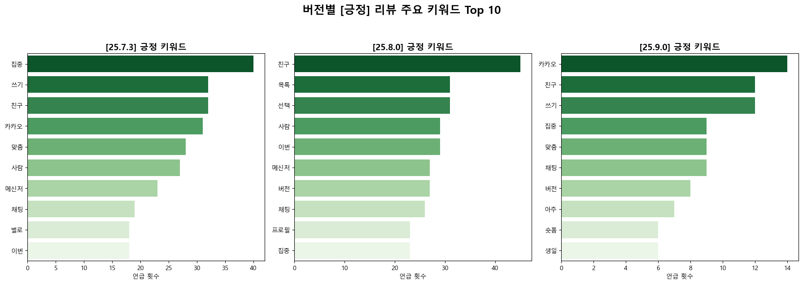
긍정으로 분류된 리뷰의 키워드는 버전의 차이는[KoElectra](https://img.shields.io/badge/Model-KoElectra--Small-green)

## 프로젝트 개요

국민 메신저 **카카오톡(KakaoTalk)** 의 특정 업데이트(v25.8.0 등) 전후로 발생하는 사용자 반응의 변화를 심층 분석한 프로젝트이다.
한국어 특화 언어 모델인 **KoElectra** 를 Fine-tuning하여 리뷰 텍스트에 담긴 **감성** 과 **구체적인 불만 원인** 을 정량적으로 도출하였다. 
최근 카카오톡의 업데이트에 어떤 의견들을 가지고 있는지를 분석하는 것을 목표로 한다.

### 분석 목표
1.  **감성 분석:** 업데이트 전/후, 논란이 된 버전의 긍정/부정 비율 변화 추적
2.  **이슈 탐지:** 부정 리뷰 내 핵심 키워드를 추출하여 구체적인 불만 원인 파악
3.  **문맥 파악:** 주요 키워드 뒤에 따르는 서술어를 분석하여 사용자 경험(UX)의 디테일한 문제점 도출

---

## 사용 기술 및 데이터

### 1. 데이터셋 (Dataset)
* **출처:** Google Play Store 리뷰 크롤링 
 google_play_scraper 라이브러리를 사용하여 크롤링 하였다.
 2000건 정도를 직접 라벨링하여 샘플 데이터로 삼았다.  
* **대상 버전:**
    * `v25.7.3` (업데이트 전)
    * `v25.8.0` (이슈 발생 버전)
    * `v25.9.0` (최신/수정 버전)
* **데이터 규모:** 약 35000건의 Raw Data
* **전처리:** * 2000건의 샘플 데이터에 대해 **3-Class 라벨링 (긍정/중립/부정)** 수행
    * **클래스 불균형(Class Imbalance)** 해결을 위한 **오버샘플링(Oversampling)** 기법 적용

### 2. 모델링 (Modeling)
* **Base Model:** `monologg/koelectra-small-v3-discriminator`
* **Fine-tuning:**
    * Epochs: 4
    * Optimizer: AdamW (Learning Rate: 5e-5)
    * Loss: CrossEntropyLoss
* **Performance:**
    * **Validation Accuracy: 94.39%**

---

## 분석 결과 

### 1. 버전별 감성 비율 변화

* **v25.7.3:** 부정 리뷰 비율이 높음. 업데이트를 일부러 안하는 사람들도 있기에 이전 버전에도 불만이 많다.
* **v25.8.0:** 부정 리뷰 비율이 높음. 업데이트에 대한 불만이 많다.
* **v25.9.0:** 부정 리뷰 비율이 높음. 여전히 부정 비율이 높지만, 긍정과 중립 비율이 증가하였다.

### 2. 주요 불만 키워드 

7.3버전과 8.0버전은 직전 버전과 패치 버전이라 그런지 거의 같은 키워드를 공유하고 있다. 9.0버전은 롤백이라는 단어가 가장 주요한 키워드이다.  
위 표를 참고하여 '메신저', '카카오', '업뎃', '친구', '광고' 이 다섯 개를 주요 키워드로 선정한 채, 문맥 분석을 시작하겠다.

### 3. 키워드 문맥 분석  

메신저와 가장 많이 붙는 단어가 충실하다. 그 다음이 아니다인 것으로 보아 메신저의 역할에 충실하지 못한 업데이트 라는 비판이 가장 많은 것으로 보인다. 그 다음으로 많이 붙는 단어는 갈아타다 인 것으로 보아 대체제를 찾는 사람이 많을 정도로 큰 파장이 있었던 것으로 보인다. 특이한 점으로는 8.0버전에는 좋다 라는 단어도 들어있다는 점이다. 비꼬는 사람도 많은 것으로 보인다.

카카오와 가장 많이 붙는 단어가 망하다. 그 다음으로 쓰다, 아니다, 가난하다, 돌리다 같은 단어인 것으로 보아 정말 망한 업데이트이고, 돌려놓았으면 좋겠다는 의견이 많은 것으로 보인다.

업뎃과 가장 많이 붙는 단어가 끄다, 막다, 불편하다, 짜증나다 와 같은 단어인 것으로 보아 업데이트를 막아놓고 싶을 정도로 업데이트가 정말 불편하고 짜증난다는 의견이 많은 것으로 보인다. 

친구 뒤에 가장 많이 붙는 단어가 아니다, 보다, 불편하다, 뜨다, 되돌리다 등인 것으로 보아 친구거나 친구가 아닌 사람의 프로필 사진 등이 계속 뜨는 것이 불편해서 이전으로 되돌려줬으면 하는 의견이 많은 것으로 보인다.

광고 뒤에 가장 많이 붙는 단어가 넣다, 받다, 미치다, 나오다, 늘리다, 많다 등인 것으로 보아 업데이트 이후 광고가 너무 많아서 미칠정도로 싫은 의견이 많은 것으로 보인다.

### 4.주요 긍정 키워드

긍정으로 분류된 리뷰의 키워드는 버전의 차이는 적다.

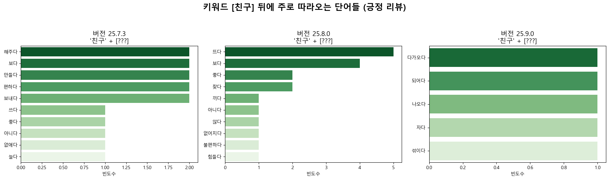
친구 뒤에 가장 많이 붙는 단어가 뜨다, 보다, 좋다 인 것으로 보아 싫어하는 점의 반대인 것을 알 수 있다.

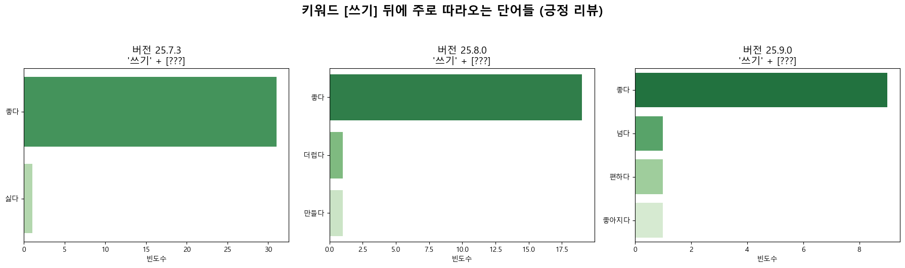

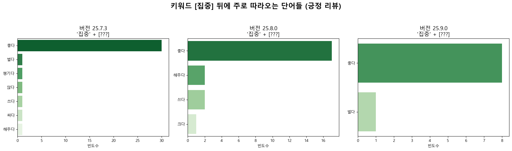

데이터가 적은 탓인지 좋다 등의 단편적인 단어가 많이 붙는 것을 알 수 있다.

### 5. 결론
본 프로젝트를 통해 카카오톡 v25.8.0 전후의 사용자 반응을 심층 분석한 결과, 다음과 같은 결론을 도출하였다.
사용자는 카카오톡이 메신저의 기능을 넘어서는 것에 대해 강한 거부감을 보이며, 이는 서비스 이탈 의지를 자극하고 있다.
'가난하다', '미치다' 등의 키워드는 무리한 광고 확장이 브랜드 가치를 훼손하고 있음을 보여준다.
v25.9.0에서 '롤백' 키워드가 부상한 점은, 사용자가 익숙한 UX로의 회귀를 원하고 있음을 증명한다.

